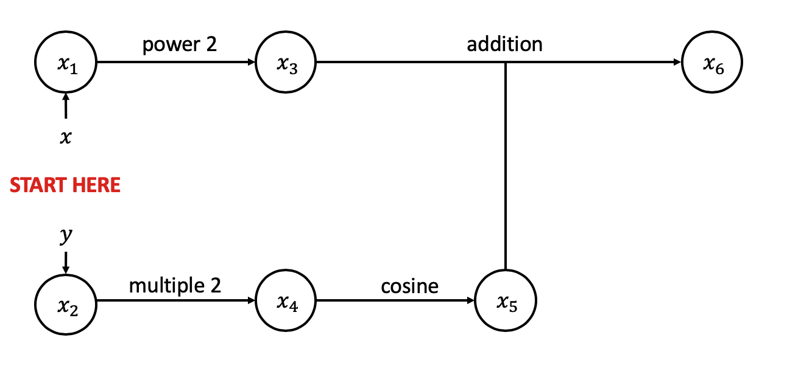

# Milestone 1 Document

<!-- START doctoc generated TOC please keep comment here to allow auto update -->
<!-- DON'T EDIT THIS SECTION, INSTEAD RE-RUN doctoc TO UPDATE -->
**Table of Contents**

- [1. Introduction](#1-introduction)
  - [1.1 What's a Derivative?](#11-whats-a-derivative)
  - [1.2 Why are Derivatives Important?](#12-why-are-derivatives-important)
  - [1.3 Symbolic Differentiation](#13-symbolic-differentiation)
  - [1.4 Finite Differences](#14-finite-differences)
  - [1.5 Advantages of Auto-Differentiation](#15-advantages-of-auto-differentiation)
- [2. Background](#2-background)
  - [2.1 Chain-Rule: The Core of Automatic Differentiation](#21-chain-rule-the-core-of-automatic-differentiation)
  - [2.2 Graph Structure of Calculations](#22-graph-structure-of-calculations)
  - [2.3 Dual Numbers](#23-dual-numbers)
- [3. How to Use `autodiffy`](#3-how-to-use-autodiff)
- [4. Software Organization](#4-software-organization)
  - [4.1 Directory Structure](#41-directory-structure)
  - [4.2 Software modules and basic functionality](#42-software-modules-and-basic-functionality)
  - [4.3 Software test suite](#43-software-test-suite)
  - [4.4 Software Distribution](#44-software-distribution)
- [5. Implementation](#5-implementation)
  - [5.1 Overview of classes:](#51-overview-of-classes)
    - [*ParseTree* class:](#parsetree-class)
    - [*ForwardMode* class:](#forwardmode-class)
  - [5.2 External dependencies:](#52-external-dependencies)

<!-- END doctoc generated TOC please keep comment here to allow auto update -->

## 1. Introduction

Differentiation forms the core of both traditional statistics methods such as Maximum-Likelihood Estimators, and leading edge methods in machine learning such as neural networks and sampling. A common problem in these fields is the need to take the gradient of an arbitrary function, which may not have a closed form analytical solution. 

Our package, `autodiffy`, addresses this by providing forward-mode automatic differentiation. Written in Python, it evaluates both the value of a user-supplied function and its derivative at a given point.

### 1.1 What's a Derivative?

In a single-variable sense, the derivative is the slope of the tangent line to the function at a given point. Formally, the derivative of a function, if it exists, is defined as

$$ f'(x) = \lim_{h\to0} \frac{f(a+h) - f(a)}{h} $$

We can also view the derivative as the effect of an infinitesimal change in the value of $x$ on the value of the function $f(x)$. This definition extends to multi-variable function.

### 1.2 Why are Derivatives Important?

Derivatives are useful in finding the maxima and minima of functions, and this has a variety of applications in statistics and machine learning.

**OLS \& Maximum Likelihood**

In statistics, we are often interested in discovering the 'right values' for parameters that explain a relationship between a response variable and some predictors. This is often phrased in terms of an optimization problem: what is the value of parameters that maximize some objective function, or equivalently, minimize some loss function.

Once phrased as an optimization problem, possibly subject to some constraints, a standard result from optimization suggests that we can examine the First-Order Condtions (FOCs) of the function by taking the derivative and setting that equal to zero in order to retrieve the optimal values.

Take, for example, the standard Ordinary Least Squares (OLS) estimator for a linear regression model of the form 

$$ Y = X\beta + \varepsilon $$

Suppose we want to find the estimate of $\beta$ denoted $\hat{\beta}$ that minimizes the Mean-Squared-Error (MSE) defined as $(Y-X\beta)^T(Y-X\beta)$. We derive the First Order Conditions (FOCs) required to solve the optimization problem. Define

$$ f(b) = \frac{(Y-Xb)^T(Y-Xb)}{2} $$

Since multiplication by a fixed scalar does not alter the result of an optimization problem, we can equivalently minimize $f(b)$. Then we have

$$ \frac{\partial f(b)}{\partial b} = -(Y-Xb)^TX $$ 

To find the MLE estimator $\hat{\beta}$, we set the FOC to zero.

$$ -(Y-X\hat{\beta})'X = 0\ \therefore\ \hat{\beta} = (X^TX)^{-1}X^TY $$

However, another approach to estimation, known as **maximum-likelihood**, uses a different objective function. The core of maximum likelihood is to ask what is the parameter value that makes the data we do observe likely to occur. That is, given the data that we have observe, what is the most likely value of the parameter we want to estimate. This likelihood that we seek to maximize is nothing more than the probability density function of the distribution that we have assumed underlies the model we are estimating. We can equivalently maximize the log of the likelihood, also known as the log-likelihood. Since this likelihood can be any probability density function, an analytical solution for its derivative may not exist.

**Hamilton-Monte Carlo Sampling**

In Bayesian statistical analysis, we are often interested in sampling from the posterior distribution of a parameter under some assumption on the priors. In particular, unless we have chosen conjugate priors, the posterior distribution we want to sample from can be arbitrarily complex, or even only known up to some scalar proportion.

Under such circumstances, a popular sampling method to sample from an arbitrary distribution is known as **Hamilton-Monte Carlo**. Incorporating the notion of momentum from physics, it seeks to explore a wider space of possible values while still ensuring that the samples tend towards high-mass regions by making high-mass regions apply a 'gravity' of sorts on particles that are pushed off in random directions with random momentum.

The core of Hamilton-Monte Carlo relies on being able to take arbitrary gradients of the log of the target distribution we want to sample from. However, since the target distribution may be arbitrarily complex, working out its derivative by hand is not always possible.

### 1.3 Symbolic Differentiation

For simple functions such as exponentials, trigonometric functions, multiplication, and addition, it is possible to derive an analytic formula for the derivative. For example, we know that the derivative of $f(x) = x^2$ is given by $f'(x) = 2x$. Since we have the analytic formula for the derivative, we can compute it to machine precision.

However, this becomes harder to do when we want to take the derivative of, for example, functions defined in the computer science sense, algorithmically and employing flow control structures such as for loops. We can use expression trees, but these become unwieldy very quickly with increased function complexity. Furthermore, there are times where an analytic expression of the function is simply not possible. The transition from OLS estimation to maximum-likelihood in statistics that we saw in the previous section illustrates this.

Furthermore, it does not address the fundamental problem that taking the derivative of a function in this way is a highly bespoke problem. That is, every new function has to be worked through, and the process is highly artisanal, prone to human error.

### 1.4 Finite Differences

Given the way the derivative is defined, a natural approximation to the symbolic derivative where it does not exist in a closed-form analytical solution, or where it is difficult to work out, is to make a discrete analogue of the definition of the derivative. That is, choose some suitably small $h$, and approximate the derivative by computing

$$ f'(x) = \frac{f(a+h) - f(a)}{h} $$

The advantage of such an approach is that it applies to any arbitrary function, including functions in the 'computer science' sense defined possibly using for loops and other such constructions. It may also seem like a 'black-box' in the sense that it requires no artisanal derivations like symbolic differentiation does.

However, the trade-off with using any finite differences method is that we lose precision. That is, the accuracy of our approximation depends on choosing a small $h$, but there is a limit to how small a $h$ we can choose. Because the finite differences method relies on division, and division is an inherently expensive operation in terms of precision, we can only at best approximate the true derivative to several orders of magnitude lower than machine precision using the finite differences method.

### 1.5 Advantages of Auto-Differentiation

- Computes derivatives to machine precision.
- Does not rely on extensive mathematical derivations or expression trees, so it is easily applicable to a wide class of functions.

## 2. Background

### 2.1 Chain-Rule: The Core of Automatic Differentiation

The chain rule is a standard calculus result that allows us to take the derivative of nested functions. We use the notation that

$$ f \circ g (x) = f(g(x))$$

Suppose we have a function $g(x)$ that is nested in another function $f(\cdot)$, and we are interested in recovering the derivative of $f(\cdot)$ with respect to $x$. The chain rule states that

$$\frac{df}{dx} = \frac{df}{dg} \frac{dg}{dx} = f'(g(x))g'(x) $$

In other words, if we can express a large, complex function as the nesting of smaller operations with known derivatives, then we can compute the derivative of the function at a particular value for each stage of this nesting structure and recover the overall derivative. These 'smaller operations' are known as **elementary operations**, with known derivatives. Our package will implement the following elementary operations:

- sin
- cos
- tan
- log
- log10
- exp
- sqrt

### 2.2 Graph Structure of Calculations

This approach naturally lends itself to writing out a complex function as the composite of elementary functions, where each node represents a function and the directed edges represent the computations that connect the nodes. As we go from the inputs to the final function, we perform the computations to evaluate the value of the function and its derivative for a given value.

This graph can be represented in a table form with the evaluation trace as well.

**Worked Example**

To illustrate how the graph structure works, we consider the following function

$$ f(x, y) = x^2 + cos(2y) $$

evaluated at $(x,\ y) = \left(2,\ \frac{\pi}{4}\right)$.

The evaluation trace looks like the following.

| Trace   | Elementary Function      | Current Value           | Elementary Function Derivative       | $\nabla_{x}$ Value  | $\nabla_{y}$ Value  |
| :---: | :-----------------: | :-----------: | :----------------------------: | :-----------------:  | :-----------------: |
| $x_{1}$ | $x_{1}$ | $2$ | $\dot{x}_{1}$ | $1$ | $0$ |
| $x_{2}$ | $x_{2}$ | $\frac{\pi}{4}$ | $\dot{x}_{2}$ | $0$ | $1$ |
| $x_{3}$ | $x_{1}^2$ | $4$ | $2\dot{x}_{1}x_1$ | $4$ | $0$ |
| $x_{4}$ | $2x_{2}$ | $\frac{\pi}{2}$ | $2\dot{x}_{2}$ | $0$ | $2$ |
| $x_{5}$ | $\cos(x_4)$ | $0$ | $-\sin(x_{4})\dot{x}_{4}$ | $0$ | $-2$ |
| $x_{6}$ | $x_{3} + x_{5}$ | $4$ | $\dot{x}_{3} + \dot{x}_{5}$ | $4$ | $-2$ |

Based on the evaluation trace above, when $(x,\ y) = \left(2,\ \frac{\pi}{4}\right)$, we have

$$ f\left(2,\ \frac{\pi}{4}\right) = 4 $$

$$ \frac{\partial f}{\partial x}\big|_{x=2, y=\frac{\pi}{4}} = 4 $$

$$ \frac{\partial f}{\partial y}\big|_{x=2, y=\frac{\pi}{4}} = -2 $$

The evaluation trace can be visualized using the following graph.



### 2.3 Dual Numbers

Dual numbers are a mathematical construct similar in structure to complex numbers. Dual numbers have a real and dual part, so we can write the dual number $f$ as

$$ f = y + \varepsilon y' $$

where $y$ is the real part and $y'$ is the dual part of the dual number. The number $\varepsilon$ is a constant with the special property that $\varepsilon^2 = 0$.

Salient to the question of automatic differentiation, dual numbers can be used to compute the derivatives of arbitrary functions. Suppose we have an arbitrary function $g(x)$ that we want to take the derivative of. We can compute $g(y + \varepsilon y)$, and the real part of that computation corresponds to the value of the function at the point $y$, while the dual part of that computation corresponds to the value of the derivative of $g(x)$ at the point $y$.

**Worked Example**

We can take the example of $g(x) = (x+1)^2$. Since this is a simple function, we can take its derivative symbolically.

$$ g'(x) = 2x + 2 $$

Now we use dual numbers to reach the same conclusion.

$$ g(x + x\varepsilon) = (x + x\varepsilon + 1)^2 = (x + x\varepsilon)^2 + 2(x + x\varepsilon) + 1 = x^2 + 2x^2\varepsilon + x^2\varepsilon^2 + 2x + 2x\varepsilon + 1 $$

Now we use the property that $\varepsilon^2 = 0$ and collect the terms to get

$$ g(x + x\varepsilon) = (x+1)^2 + (2x^2 + 2)\varepsilon $$

We can see that the real part of this is the value of the function at the point $x$, and the dual part of this is the value of the derivative at the point $x$. We do not use dual numbers directly in our package, but in the same vein, we compute and return both the value of the derivative and the value of the function at a given point.

## 3. How to Use `autodiffy`

This package will be primarily used by software developers and students looking to perform forward-mode differentiation on an expression at a given point. 

The implementation will focus on the command line interface between the user and the program. To start, the user shall create and then activate a virtual environment with `conda create -n [EXAMPLE_ENVIRONMENT] python=3.7 anaconda` and `source activate [EXAMPLE_ENVIRONMENT]`. 

After the environment is created, the user can then install our package with conda or pip install. 

When running the exectuable file the user will be prompted via terminal, after a welcome introduction, to choose from options (1), (2), or (3). Option (1) would specify the users intent to use a univariate function, (2) - a multivariate function, and (3) - a vector function. After choosing an option the user would be asked to specify variable character(s) they'd like to use to define their function expression. 

An example entry for case (1) would be `x`, as a primary varaiable character. `x` would then be stored in our *ForwardMode* class as the default character for the expression. 

The user would then be prompted, again via terminal, to enter their function directly into the terminal as close to as its written. Our program would parse this input string and look to build the expression fully in our *ForwardMode* object by searching for fundamental mathemtical operations such as +, -, *, /, ^, sin, cos,exponents, ln, log, etc and some of the other ways they could be written (i.e ^ == ** , etc). Once entered, our program would re-display their entry, but this time in our *ForwardMode*'s version to ensure accuracy of intent by the user, with them being able to select (1) if everything appears correctly or (2) if they need to re-enter the expression.

Lastly, after confirmation that the expression was interpreted by *ForwardMode* correctly, the user will be asked to specify the value(s) at which the expression should be evaluated at for each input variable they entered earlier.

*ForwardMode* then would calculate the value of the function and its derivative at the point values specificed by the user and output them in the terminal.

The input/output UI will be encapsulated in a `while` loop such that the user can continue to define and evaluate more functions, or quit when done.

## 4. Software Organization

### 4.1 Directory Structure 

```
├───docs/
│   ├───m1_image/
│   │   └─── ...
│   ├───tex/
│   │   └─── ...
│   ├───milestone1.md
│   └───milestone1.tex.md
├───autodiffy/
│   ├───compute/
│   │   └─── ...
│   ├───interface/
│   │   └─── ...
│   ├───parse/
│   │   └─── ...
│   └───tests/
│       └─── ...
├───minutes/
│   └─── ...
├───.pre-commit-config.yaml
├───.travis.yml
├───README.md
├───LICENSE
└───requirements.txt
```

**implementation/ Directory**

The `implementation/` directory contains our code implementing forward mode differentiation. The modules and functionality implemented in our package are described in the next section.

**Root Directory**

The root of the repository contains the following:

- `LICENSE` containing the license for the project
- `README.md` for the entire project.
- `requirements.txt` that outline the python dependencies for installing our package
- `.travis.yml` which contains our configuration for `TravisCI`
- `.pre-commit-config.yaml` which contains configuration for implementing [doctoc](https://github.com/thlorenz/doctoc) as a [pre-commit](https://pre-commit.com/) hook
  - This allows for automatic generation of tables of contents for all our `.md` files

**docs/ Directory**

The `docs/` directory contains documentation and milestones as required by the CS207 course staff. More information can be found in the `README.md` in the folder.

**minutes/ Directory**

The `minutes/` directory contains the minutes from our group meetings.

### 4.2 Software modules and basic functionality

Our package has 4 main modules:

- The `interface` module handles the way in which the user may use our package interactively; for example, through a GUI.

- The `parse` module handles the way in which our package, whether used in a script or interactively, processes user input.

- The `compute` module handles the calculations that are at the heart of our package.

- The `tests` module contains tests for continuous integration and development.

### 4.3 Software test suite

- The test suite will will be placed in the test directory. `TravisCI` will be used for continous integration testing. `Codecov` will be used for code coverage testing.

### 4.4 Software Distribution 

- Our package will be distributed on `PyPI`. 

## 5. Implementation

1. Create a class called *ForwardMode* that keeps track of expression value and derivative(s) and updates these values as operations are applied to a *ForwardMode* object. The constructor takes in the value of the expression (e.g 2.0) and a dictionary that contains the partial derivatives of all the distinct variables in the expression (e.g. {x: 1, y: 0}) and sets this value and dictionary to be attributes. Then, a method will be created for each binary and unary operator that can be applied to a *ForwardMode* object. Unary methods include: *\_\_neg\_\_*, *sin*, *cos*, *tan*, *log*, *log10*, *exp* and *sqrt*. This means that when a *ForwardMode* object is passed into a numpy function such as np.sin, the *sin* method with be called instead of np.sin. All these methods will do two things: first, they'll update the value attribute of the *ForwardMode* object, and second they'll update the partial derivatives of the dictionary attribute. As a concrete example, the *sin* method will return a new *ForwardMode* object where the value is np.sin(self.value) and the partial derivative dictionary is *{variable: np.cos(self.value) \* derivative for variable, derivative in self.derivative_dict.items()}*. Meanwhile, binary methods include: *__add__*, *\_\_radd\_\_*, *\_\_sub\_\_*, *\_\_rsub\_\_*, *\_\_mul\_\_*, *\_\_rmul\_\_*, *\_\_truediv\_\_*, *\_\_rtruediv\_\_*, *\_\_pow\_\_* and *\_\_rpow\_\_*. For these methods, duck typing will be used to determine whether the other argument is a *ForwardMode* object or a numerical object (i.e. integer or float). As a concrete example, the *\_\_add\_\_* , method will first try to add the *value* attributes of the given *ForwardMode* object and the object passed in and will try to add their partial derivatives for each variable. However, if this results in an AttributeError (i.e. if the object passed in is not a *ForwardMode* object), then the value of the new *ForwardMode* object will be the *value* attribute of the given *ForwardMode* object plus the object passed in, and the dictionary of partial derivatives will remain the same. Because addition is a commutative operation, the *\_\_radd\_\_* method will simply return *self + argument*.

2.	Next, an expression that is a function of an arbitrary number of variables will be passed in (by the user) and broken into a list of its constituent parts. For example, *'exp(-(sin(x) – cos(y)) \*\* 2)'* will be processed and transformed to *['(', 'exp', '(', '-', '(', 'sin', '(', 'x', ')', '-', 'cos', '(', 'y', ')', ')', '\*\*', '2', ')', ')']*.

3. Next, the list that was generated in step 2 will be converted into a binary tree. This will be achieved by iterating over the elements of the list in order and following the following rules:
	* Beginning of list -> create tree with empty root node
	* Left parentheses ('(') -> insert left child with node value left blank and move down to this new left child
	* Right perentheses (')') -> move up tree to parent node
	* Binary operator ('+', '-', '\*', '/', '\*\*') -> set node value to given binary operator and insert right child with node value left blank. Then move down to this new right child 
	* Unary operator ('exp', 'sin', 'cos', 'tan', 'log', 'log10', 'sqrt', 'neg') -> set node value to given unary operator and insert left child with node value left blank (this subtree will not have a right child). Then move down to this new left child
	* Numeric value or variable (e.g. x, y) -> set node value to given number or variable (literally 'x' or 'y', etc.) and move up to parent node

4. Implement the forward mode by performing the following steps on the binary tree created in step 3 (refer to this function as *evaluate_tree*):
	* get the left and right children of the root node
	* if there is no left or right child this means that the give node is a leaf, so this node value should be evaluated: a numeric node value simply evaluates to that number, while a node value that is a variable (i.e. 'x' or 'y') is evaluated by creating a *ForwardMode* object where the *value* attribute is set to the value at which the given variable is to be evaluated and the dictionary of partial derivatives is created such that the value corresponding to all the variable keys is 0 except for the value corresponding to the node variable, which is set to 1 (i.e. if there are 3 variables, 'x', 'y' and 'z', and the node value is 'y', then the following partial derivative dictionary is created: {'x': 0, 'y': 1, 'z': 0}).
	* if there is no right child (but there is a left child), then this means that the value stored at the given node is a unary operator. Evaluating this node amounts to applying the given unary operator to the *ForwardMode* object that results from recursively applying this function (*evaluate_tree*) to the left tree of the given node. 
	* if there is both a right child and a left child, then this means that the value stored at the given note is a binary operator. Evaluating this node amounts to applying the given binary operator to the *ForwardMode* objects that result from recursively applying this function (*evaluate_tree*) to both the left tree and the right tree of the given node. 

### 5.1 Overview of classes:

#### *ParseTree* class:

attributes: 

- *expression* (in form of list created in step 1)
- *variables* dictionary that maps all variables in expression to the value at which they are to be evaluated
- *binary_tree* that is initially set to None but will later be replaced with the binary tree created in step 3. 
- *result* that is initially set to None but will later be replaced with a ForwardMode object that contains the final value and all the partial derivatives 

methods:

- *build_parse_tree* that implements step 3 and sets binary_tree attribute to the resulting tree 
- *implement_forward_mode* that implements step 4 and sets result attribute to the ForwardMode object outputted from the binary tree
- *get_value* that retrieves evaluation of expression stored in *result* attribute
- *get_derivative* that retrieves dictionary of partial derivatives stored in *result* attribute

#### *ForwardMode* class:

attributes:

- *value*
- *derivative_dictionary*

methods:
- *sin*
- *cos*
- *tan*
- *log*
- *log10*
- *exp*
- *sqrt*
- *\_\_neg\_\_*
- *\_\_add\_\_*
- *\_\_radd\_\_*
- *\_\_sub\_\_*
- *\_\_rsub\_\_*
- *\_\_mul\_\_*
- *\_\_rmul\_\_*
- *\_\_truediv\_\_*
- *\_\_rtruediv\_\_*
- *\_\_pow\_\_* 
- *\_\_rpow\_\_*

### 5.2 External dependencies: 
- `numpy`
- `operator` module so that binary operators can be expressed as operator.xxxx(argument1, argument2)
- `pythonds.trees` for access to `BinaryTree` class
- `pythonds.basic` for access to `Stack` class in order to keep track of current node in binary tree
